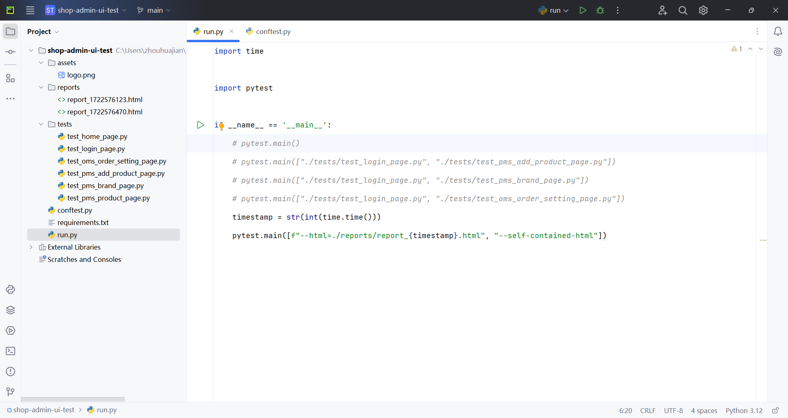
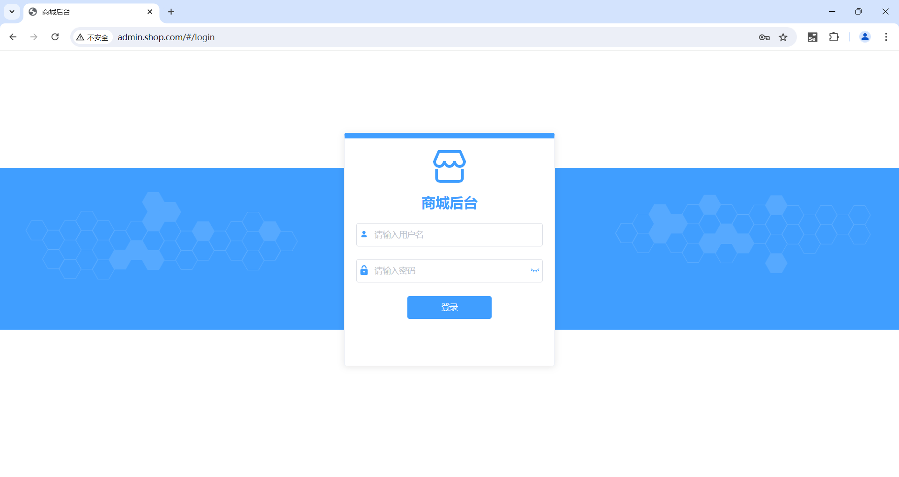
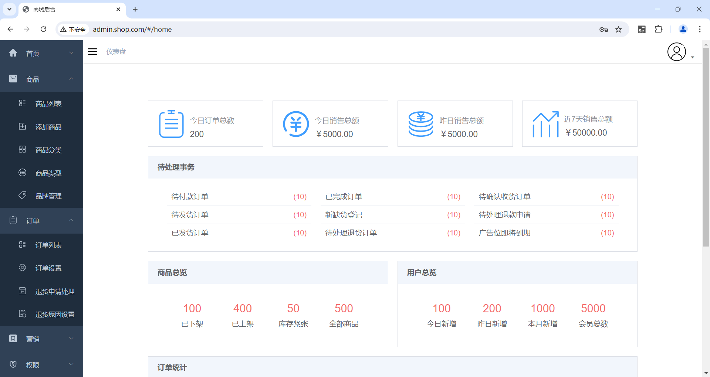

# Pytest + Selenium 商城UI测试 项目实践

## 课程介绍

本课程使用 pytest + pytest-order + pytest-html + Selenium + Selenium IDE，带大家一起实现商城后台的 UI 自动化测试。

课程内容为：

- 介绍测试需求
- 自动测试账号登录
- 自动测试商品列表
- 自动测试添加商品
- 自动测试品牌管理
- 自动测试订单设置
- 生成测试报告

课程亮点有：

- 使用 Selenium IDE 录制操作，并生成代码
- 使用模块化的方式管理测试用例
- 分析 pytest-selenium 不适用的原因
- 介绍 pytest-selenium 源码
- 介绍 Selenium IDE 命令调试
- 使用 Selenium 的隐式等待和显式等待
- 使用 pytest-order 实现登录相关的测试用例优先执行
- 介绍常见UI测试断言方式
- 使用 baseurl 测试夹具，实现测试不同环境的项目
- 使用 driver 测试夹具，实现所有测试用例使用同一个浏览器 session
- 介绍使用 Selenium IDE 上传本地文件
- 介绍 Selenium WebDriverWait、ActionChains 等高级用法
- 介绍如何跳过测试用例
- 自定义 pytest-html 测试报告
- 介绍 pytest-html 源码
- 介绍 pytest 插件开发的钩子说明、钩子实现

发布于 2024 年 8 月

## 相关截图

